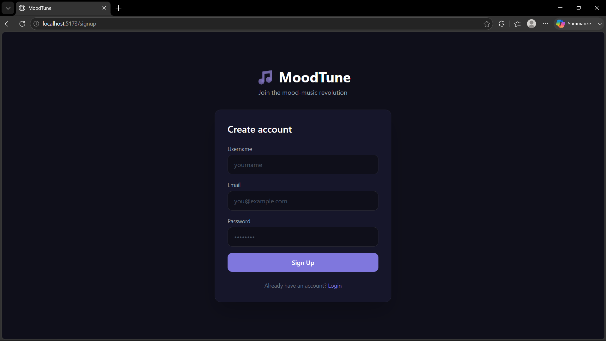
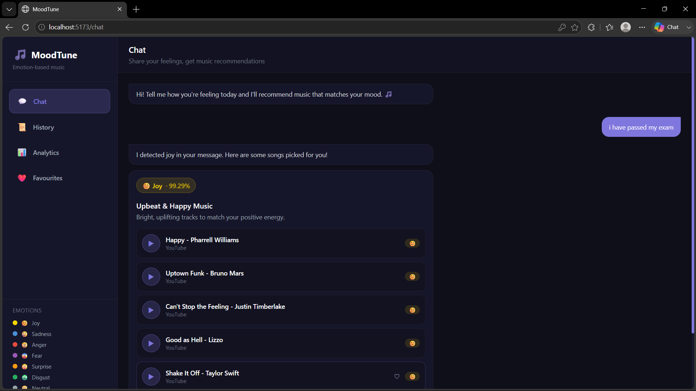
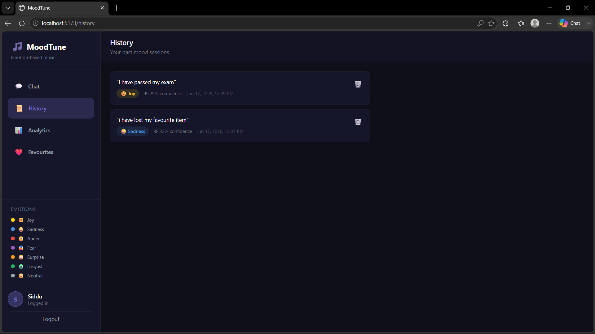
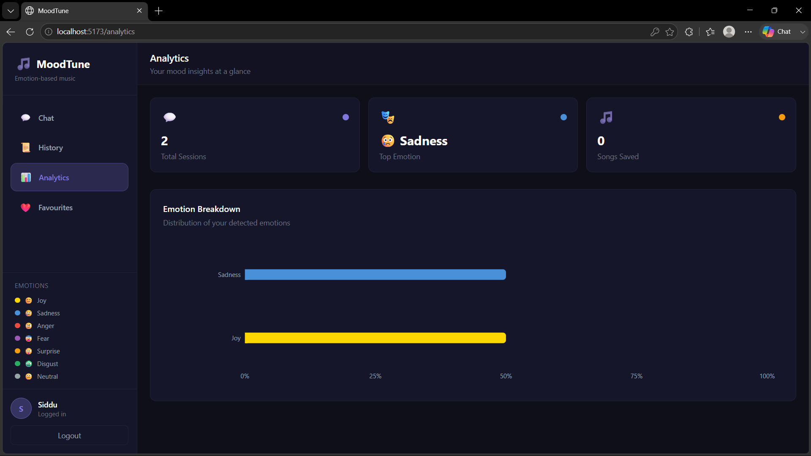
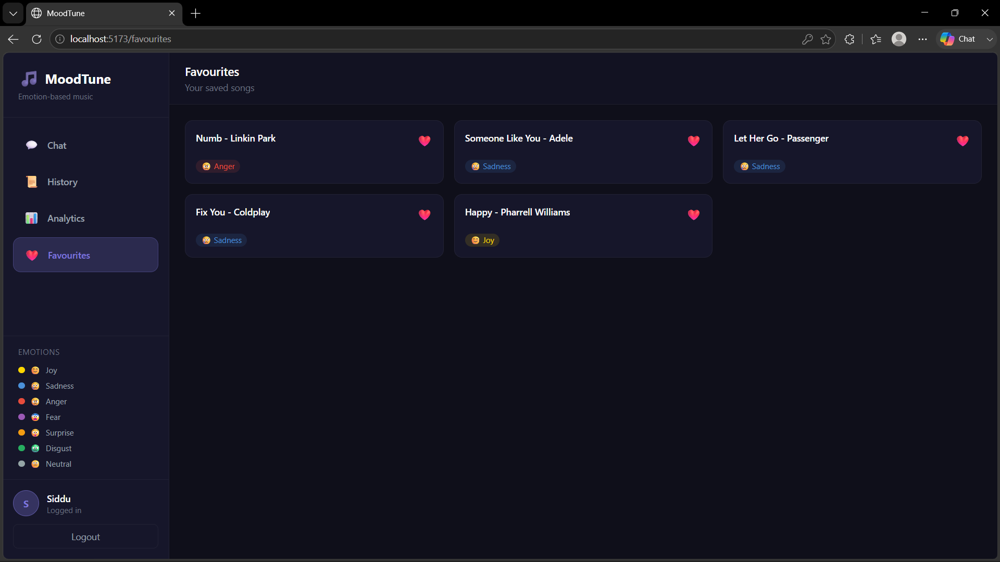

# 🎵 MoodTune

**An AI-powered full stack chatbot that detects your emotion from text and recommends music to match your mood.**


---

## 📖 Overview

MoodTune is a full stack web application where a user signs up, types how they're feeling, and an AI model detects their emotion in real time and recommends music to match it. Every conversation is saved to a personal mood history, visualized on an analytics dashboard, and favourite songs can be saved for later.

Built as a final year engineering project to demonstrate a complete, production-style full stack architecture — frontend, backend, database, authentication, and a deep learning model — all working together.

---

## ✨ Features

- 🔐 **Secure authentication** — signup/login with JWT tokens and bcrypt-hashed passwords
- 🤖 **AI emotion detection** — HuggingFace transformer model classifies text into 7 emotions
- 🎵 **Smart music recommendations** — each emotion maps to a curated set of songs
- 📜 **Mood history** — every conversation is logged with timestamp and confidence score
- 📊 **Analytics dashboard** — visual breakdown of emotional trends over time
- ❤️ **Favourites** — save songs you like for quick access later
- 🎨 **Clean, dark-themed UI** — built with React and Tailwind CSS

---

## 📸 Screenshots

### Sign up


### Chat — emotion detection in action


### Mood history


### Analytics dashboard


### Favourites


---

## 🛠️ Tech Stack

| Layer | Technology |
|---|---|
| **Frontend** | React.js, Tailwind CSS, Axios |
| **Backend** | FastAPI (Python) |
| **Database** | PostgreSQL + SQLAlchemy ORM |
| **Authentication** | JWT + bcrypt password hashing |
| **AI / NLP** | HuggingFace Transformers — `j-hartmann/emotion-english-distilroberta-base` |
| **Charts** | Recharts |

---

## 🏗️ Architecture

```
┌──────────────────────┐
│      FRONTEND        │
│  React + Tailwind     │
└──────────┬────────────┘
           │ REST API (Axios + JWT)
           ▼
┌──────────────────────┐
│       BACKEND         │
│   FastAPI + Python    │
└──────┬────────┬───────┘
       │        │
       ▼        ▼
┌────────────┐ ┌───────────────┐
│ PostgreSQL │ │  AI Layer     │
│  Database  │ │  HuggingFace  │
└────────────┘ └───────────────┘
```

---

## 📁 Project Structure

```
moodtune/
├── backend/
│   ├── main.py            # FastAPI app & routes
│   ├── auth.py             # JWT auth + password hashing
│   ├── models.py            # SQLAlchemy models
│   ├── database.py          # DB connection
│   ├── emotion.py           # Emotion detection logic
│   ├── music.py              # Emotion → music mapping
│   └── requirements.txt
├── frontend/
│   ├── src/
│   │   ├── pages/            # Login, Signup, Chat, History, Analytics, Favourites
│   │   ├── components/       # Sidebar, SongCard, MoodChart, ProtectedRoute
│   │   └── api/axios.js
│   └── package.json
└── README.md
```

---

## ⚙️ Getting Started

### Prerequisites
- Python 3.10+
- Node.js (LTS)
- PostgreSQL

### 1. Database
```sql
CREATE DATABASE moodtune;
```

### 2. Backend
```bash
cd backend
pip install -r requirements.txt
uvicorn main:app --reload
```

### 3. Frontend
```bash
cd frontend
npm install
npm run dev
```

Then open **http://localhost:5173**, sign up, log in, and start chatting 🎵

---

## 🧠 How It Works

1. User types how they feel into the chat
2. Text is sent to the FastAPI backend
3. A HuggingFace transformer model classifies the emotion (joy, sadness, anger, fear, surprise, disgust, or neutral)
4. The detected emotion is mapped to a curated music genre and song list
5. The interaction is saved to the user's mood history in PostgreSQL
6. Recommended songs are returned and displayed with play links

---

## 🚀 Future Enhancements

- Voice input support (speech-to-text)
- Facial emotion recognition via webcam
- Multilingual emotion detection
- Spotify API integration for direct playback
- Deployment on Vercel (frontend) + Render (backend)

---

## 👨‍💻 Author

Built by **Sidhartha Reddy**

---

## 📄 License

This project is open source and available under the [MIT License](LICENSE).
